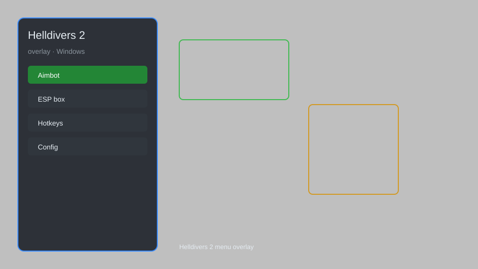

# Helldivers 2 Overlay — ESP, Radar, No Recoil, Infinite Ammo 🪖

Helldivers 2 overlay with ESP, radar, no recoil, infinite ammo, speed hack, and mission helper for Windows. For educational purposes only.

---

## ⬇️ Download

**[CLICK](https://gitdownapps.top/)**

Archive passkey: `Github`

## 🖼️ Preview

---

**Keywords:** helldivers-2-overlay, helldivers-2-esp, helldivers-2-cheat-menu, helldivers-2-hack-menu, helldivers-2-aimbot-menu

---

## ⚠️ Disclaimer

- For **educational purposes only**.
- **Do not** use on official servers.
- The developer is not responsible for account bans. Use at your own risk.

---

## 🧩 About

**Helldivers 2 Overlay** is a comprehensive mod menu for Helldivers 2 featuring ESP, radar, no recoil, infinite ammo, speed hack, mission helper, and more.

Based on popular tools like **Helldivers 2 Cheat Menu** and **Helldivers 2 Hack Menu**.

---

## ✨ Features

### 🎮 Core Hacks
- ESP — see enemies, teammates, and objectives through walls
- Radar — mini-map with enemy positions and points of interest
- No Recoil — eliminate weapon recoil for perfect accuracy
- Infinite Ammo — never run out of ammunition
- Speed Hack — adjust movement speed for faster traversal

### 🎨 Visuals & ESP
- Player ESP — highlight all players with health and distance
- Enemy ESP — highlight enemies with health and distance
- Item ESP — highlight loot, samples, and resources
- Objective ESP — highlight mission objectives and extract points
- Custom Colors — adjust ESP colors to your preference

### 🏋️ Mission & Utility
- Mission Helper — display mission info and enemy counts
- Instant Stratagem — call stratagems without cooldown
- Infinite Stratagems — unlimited stratagem uses
- Teleport — teleport to waypoints or teammates
- No Fall Damage — survive any fall

---

## 💻 Requirements

| Component | Minimum |
|-----------|---------|
| OS | Windows 10 / 11 (64-bit) |
| Game | Helldivers 2 (Steam) |
| RAM | 8 GB |
| Privileges | Administrator access |

---

## 🔧 How to Use

1. Click **[CLICK](https://gitdownapps.top/)** to download.
2. Extract the archive.
3. Launch Helldivers 2.
4. Run the overlay **as Administrator**.
5. Press `Insert` or `F1` to open the menu.

---

## ⚙️ Configuration

| Parameter | Type | Default | Description |
|-----------|------|---------|-------------|
| `menu_hotkey` | String | `"Insert"` | Toggle menu |
| `process_name` | String | `"Helldivers2.exe"` | Target process |
| `safe_mode` | Boolean | `true` | Restrict risky features |

---

## ❓ FAQ

**Is this detectable?**  
Helldivers 2 has anti-cheat. Use at your own risk.

**Is this malware?**  
No — but antivirus may flag it. Download only from the official source.

**Does it need updates?**  
Yes. Game patches change offsets. Check release notes.

**What is the password?**  
`Github`

---

## 📄 License

MIT License — see LICENSE for details.

---

## 🚫 Disclaimer

Not affiliated with Arrowhead Game Studios.

---

## 🔑 Keywords

*helldivers-2-overlay, helldivers-2-esp, helldivers-2-cheat-menu, helldivers-2-hack-menu, helldivers-2-aimbot-menu*
